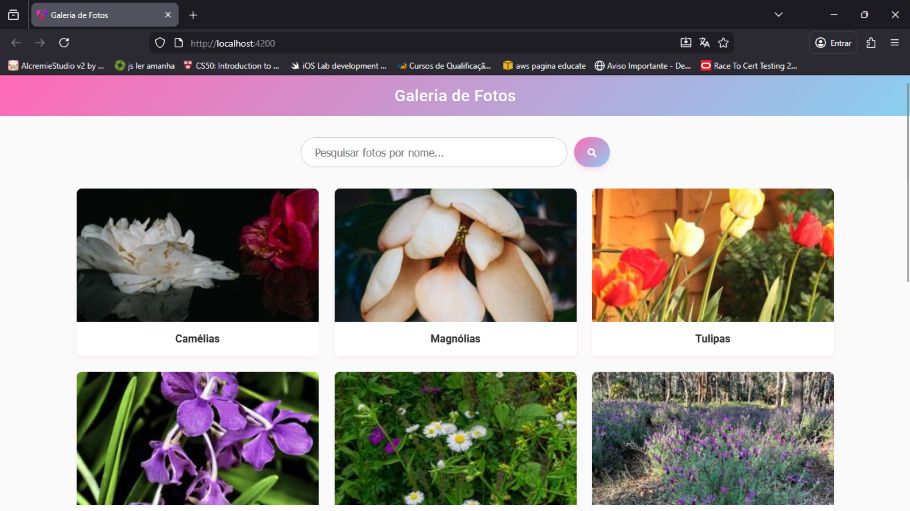
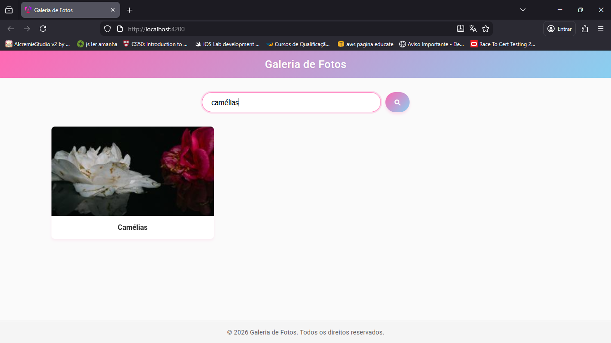

# Sobre

O objetivo deste projeto é otimizar a visualização de portfólios fotográficos, oferecendo uma solução moderna e responsiva para substituir galerias estáticas e pouco interativas.

Foi desenvolvida uma Single Page Application (SPA) em **Angular 17+** que permite a visualização e busca instantânea de fotos, com uma interface fluida, responsiva e esteticamente refinada.

# Instruções

Abaixo descreve-se como foi realizado o desafio (Enunciado 02). Antes de explicar o código, é necessário preparar o ambiente:

### Tecnologias usadas:

    Angular 17+ (Standalone Components): Para arquitetura modular e moderna.
    TypeScript: Para tipagem estática e segurança no código.
    CSS3 (Flexbox/Grid): Para layouts responsivos e estéticos.
    RxJS: Para manipulação reativa de dados.
    Instalações necessárias: Node.js instalado na máquina.

## Instalação das Dependências (Terminal)

```bash
npm install
```

## 0. Configurando e Rodando o Projeto

Para rodar a aplicação, após clonar o repositório e instalar as dependências, executamos o comando configurado no package.json:

```bash
npm start
```

Isso iniciará o servidor de desenvolvimento em `http://localhost:4200`.

## 1. Gerenciamento de Dados (photo.service.ts)

Para garantir a separação de responsabilidades (Requisito de Serviço), foi implementado um serviço dedicado que fornece os dados mockados via `Observable`.

```typescript
@Injectable({ providedIn: 'root' })
export class PhotoService {
  private photos: Photo[] = [
    { id: 1, title: 'Camélias', url: '...' },
    // ... mais 11 fotos
  ];

  getPhotos(): Observable<Photo[]> {
    return of(this.photos);
  }
}
```

## 2. Componentização (Standalone Components)

A aplicação foi dividida em componentes independentes para facilitar a manutenção e reutilização.

*   **Header**: Contém a identidade visual e título.
*   **Gallery**: O componente inteligente que gerencia o estado da busca e a lista de fotos.
*   **PhotoCard**: Componente de apresentação, responsável por exibir cada imagem individualmente com estilos e animações.

## 3. Buscando Fotos (Requisito de Busca)

Foi implementada uma busca em tempo real que filtra as fotos conforme o usuário digita.

```typescript
filterPhotos(): void {
  const term = this.searchTerm.toLowerCase().trim();
  if (!term) {
    this.filteredPhotos = this.photos;
  } else {
    this.filteredPhotos = this.photos.filter(photo =>
      photo.title.toLowerCase().includes(term)
    );
  }
}
```

## 4. Responsividade e Layout

Utilizou-se **CSS Grid** para a galeria e **Flexbox** para alinhamentos, garantindo que o layout se adapte a qualquer tamanho de tela (Mobile-First).

```css
.photo-grid {
  display: grid;
  grid-template-columns: repeat(auto-fill, minmax(300px, 1fr));
  gap: 20px;
}
```

## Diferenciais e UX (Experiência do Usuário)

Além dos requisitos funcionais, buscou-se oferecer uma experiência premium:

    Navegação Intuitiva: Barra de busca com ícone profissional e feedback visual imediato.
    Visualização Limpa: Estética "Clean & Floral", com gradientes suaves, sombras delicadas (Pink Glow) e tipografia legível (Roboto).
    Feedback Claro: Mensagem amigável de "Nenhuma foto encontrada" quando a busca não retorna resultados.
    Animações Fluidas: Efeitos de Fade-in ao carregar e Zoom suave ao passar o mouse sobre as fotos.

## Resultados

Para demonstrar o funcionamento completo da aplicação, veja abaixo o resultado final:

### Página Inicial


### Resultado da Pesquisa

